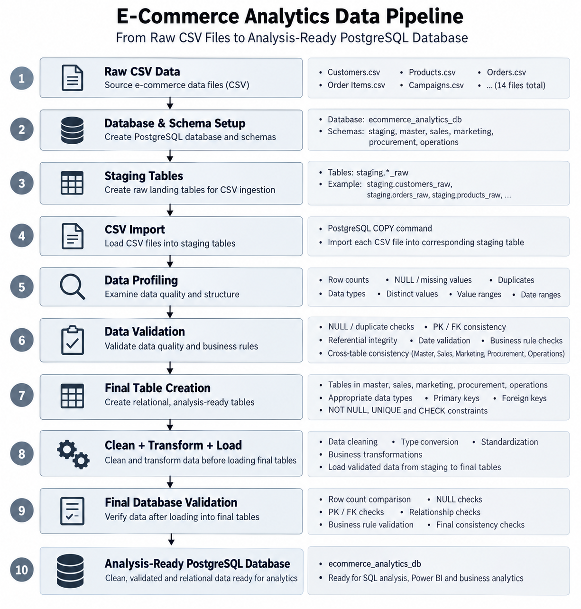
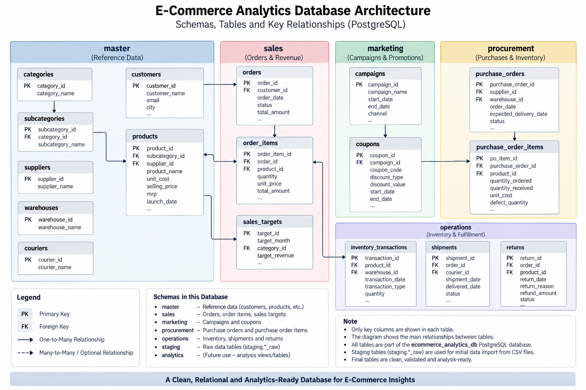

# E-Commerce Analytics Database ETL Pipeline

## Project Overview

This project demonstrates an end-to-end PostgreSQL ETL pipeline that transforms raw e-commerce CSV data into a clean, validated, relational, and analysis-ready database.

The project focuses on data preparation and database engineering rather than business analysis. It is designed to create a reusable analytical database foundation for downstream SQL, Power BI, and business analytics projects.

## Project Objective

The main objective of this project is to demonstrate how raw CSV data can be converted into a structured PostgreSQL database using a systematic data preparation and ETL workflow.

The pipeline covers:

- CSV data ingestion
- Staging layer creation
- Data profiling
- Data quality validation
- Relational table design
- Primary and foreign key implementation
- Data cleaning and transformation
- Loading data into final tables
- Final database validation
- Creation of an analysis-ready database

## What This Project Demonstrates

This project demonstrates practical skills in:

- Handling raw CSV datasets
- Designing a PostgreSQL database structure
- Creating staging and final tables
- Working with multiple schemas
- Data profiling and quality assessment
- Handling NULL and duplicate records
- Data validation and business-rule checks
- Defining primary keys and foreign keys
- Maintaining referential integrity
- Applying data types and constraints
- Cleaning and transforming data during loading
- Loading validated data into final tables
- Performing final database-level validation
- Preparing data for downstream analytics

## Data Pipeline

The project follows the following data preparation workflow:

Raw CSV Data  
↓  
Database & Schema Setup  
↓  
Staging Table Creation  
↓  
CSV Import  
↓  
Data Profiling  
↓  
Data Validation  
↓  
Final Table Creation  
↓  
Clean + Transform + Load  
↓  
Final Database Validation  
↓  
Analysis-Ready PostgreSQL Database

### Pipeline Diagram

## Database Architecture

The database is organized into multiple schemas to separate raw ingestion, reference data, transactional data, marketing data, procurement data, operational data, and future analytical objects.

### Database Architecture Diagram

## Database Schemas

| Schema | Purpose |
|---|---|
| `staging` | Raw CSV data imported into staging tables |
| `master` | Core reference and master data |
| `sales` | Orders, order items, and sales targets |
| `marketing` | Campaign and coupon data |
| `procurement` | Purchase orders and purchase order items |
| `operations` | Operational data such as inventory, shipments, and returns |
| `analytics` | Reserved for future analytical views/tables |

The staging layer is kept separate from the final relational tables so that raw imported data can be profiled and validated before being transformed and loaded into the final database.

## Core Final Tables

### Master

- `master.categories`
- `master.subcategories`
- `master.suppliers`
- `master.warehouses`
- `master.couriers`
- `master.customers`
- `master.products`

### Sales

- `sales.orders`
- `sales.order_items`
- `sales.sales_targets`

### Marketing

- `marketing.campaigns`
- `marketing.coupons`

### Procurement

- `procurement.purchase_orders`
- `procurement.purchase_order_items`

### Operations

- Operational tables for inventory, shipments, returns, and related fulfillment data

The final database is designed as a relational structure with primary keys, foreign keys, constraints, and cross-table relationships.

## SQL Workflow

The SQL scripts are organized according to the data preparation lifecycle.

| Step | SQL File | Purpose |
|---|---|---|
| 01 | `01_database_setup.sql` | Create database and schemas |
| 02 | `02_staging_tables.sql` | Create raw staging tables |
| 03 | `03_csv_import.sql` | Import CSV files into staging tables |
| 04 | `04_data_profiling.sql` | Profile data quality and structure |
| 05 | `05_master_data_validation.sql` | Validate master data |
| 06 | `06_sales_data_validation.sql` | Validate sales data |
| 07 | `07_marketing_data_validation.sql` | Validate marketing data |
| 08 | `08_procurement_data_validation.sql` | Validate procurement data |
| 09 | `09_operations_data_validation.sql` | Validate operational data |
| 10 | `10_final_tables.sql` | Create final relational tables |
| 11 | `11_master_data_load.sql` | Clean, transform, and load master data |
| 12 | `12_sales_data_load.sql` | Clean, transform, and load sales data |
| 13 | `13_marketing_data_load.sql` | Clean, transform, and load marketing data |
| 14 | `14_procurement_data_load.sql` | Clean, transform, and load procurement data |
| 15 | `15_operations_data_load.sql` | Clean, transform, and load operational data |
| 16 | `16_final_data_validation.sql` | Perform final database validation |

## Data Quality & Validation

Data quality checks are performed before and after loading the final tables.

### Profiling

The profiling stage examines:

- Row counts
- NULL values
- Duplicate records
- Distinct values
- Data types
- Value distributions
- Numeric ranges
- Date ranges
- Basic data consistency

### Validation

Validation includes checks for:

- Missing required values
- Duplicate primary-key values
- Primary-key uniqueness
- Foreign-key consistency
- Referential integrity
- Invalid dates
- Invalid numeric values
- Domain and status values
- Cross-table consistency
- Business-rule violations

### Final Validation

After the data is loaded into the final tables, additional checks are performed to verify that the final database remains consistent, relationally valid, and suitable for downstream analysis.

## Database Design & Constraints

The final tables use relational database design principles including:

- Primary keys
- Foreign keys
- `NOT NULL` constraints
- `UNIQUE` constraints
- `CHECK` constraints
- Appropriate PostgreSQL data types
- Referential integrity
- Cross-table relationships

These constraints help maintain data integrity and make the database reliable for downstream analytical use.

## Repository Structure

e-commerce-analytics-database-etl/
│
├── README.md
│
├── sql/
│   ├── 01_database_setup.sql
│   ├── 02_staging_tables.sql
│   ├── 03_csv_import.sql
│   ├── 04_data_profiling.sql
│   ├── 05_master_data_validation.sql
│   ├── 06_sales_data_validation.sql
│   ├── 07_marketing_data_validation.sql
│   ├── 08_procurement_data_validation.sql
│   ├── 09_operations_data_validation.sql
│   ├── 10_final_tables.sql
│   ├── 11_master_data_load.sql
│   ├── 12_sales_data_load.sql
│   ├── 13_marketing_data_load.sql
│   ├── 14_procurement_data_load.sql
│   ├── 15_operations_data_load.sql
│   └── 16_final_data_validation.sql
│
├── sample_data/
│   └── Sample CSV files
│
└── docs/
    ├── data_pipeline.png
    └── database_architecture.png

## Technology Stack

- **Database:** PostgreSQL
- **Database Management:** pgAdmin
- **Language:** SQL
- **Source Data:** CSV
- **Version Control:** Git / GitHub
- **Downstream Analytics:** SQL, Power BI, and other analytical tools

## How to Run

### Prerequisites

- PostgreSQL
- pgAdmin or another PostgreSQL client
- Access to the sample CSV files

### Execution Order

Run the SQL scripts in the following order:

1. `01_database_setup.sql`
2. `02_staging_tables.sql`
3. `03_csv_import.sql`
4. `04_data_profiling.sql`
5. `05_master_data_validation.sql`
6. `06_sales_data_validation.sql`
7. `07_marketing_data_validation.sql`
8. `08_procurement_data_validation.sql`
9. `09_operations_data_validation.sql`
10. `10_final_tables.sql`
11. `11_master_data_load.sql`
12. `12_sales_data_load.sql`
13. `13_marketing_data_load.sql`
14. `14_procurement_data_load.sql`
15. `15_operations_data_load.sql`
16. `16_final_data_validation.sql`

### CSV Import Note

The CSV import script uses local file paths for PostgreSQL CSV ingestion.

Before running `03_csv_import.sql`, update the CSV file paths in the script according to the local location of the downloaded `sample_data` files.

The repository does not assume a fixed local file path because file locations differ between systems.

## Project Scope

This repository focuses on database creation, data preparation, ETL, and data quality validation.

It does not contain:

- Business analysis
- KPI analysis
- Power BI dashboards
- Customer segmentation
- Sales performance analysis
- Predictive modeling

The resulting database is intended to serve as a reusable data source for separate analytics and BI projects.

## Downstream Analytics Usage

The database created by this project can be reused as a common data source for downstream analytical projects such as:

- E-Commerce Sales & Executive Analytics
- Customer Analytics
- Product & E-Commerce Analytics
- Marketing & Conversion Funnel Analytics
- Supply Chain & Logistics Analytics
- Customer Experience & After-Sales Analytics

These projects can connect to the final PostgreSQL database and perform business analysis using SQL, Power BI, Excel, Python, or other analytical tools.

## Key Outcome

The final outcome is a clean, validated, relational, and analysis-ready PostgreSQL database built from raw CSV source data through a structured ETL and data-quality workflow.

## Author

**Anurag Dwivedi**

Data Analytics | SQL | PostgreSQL | Power BI
